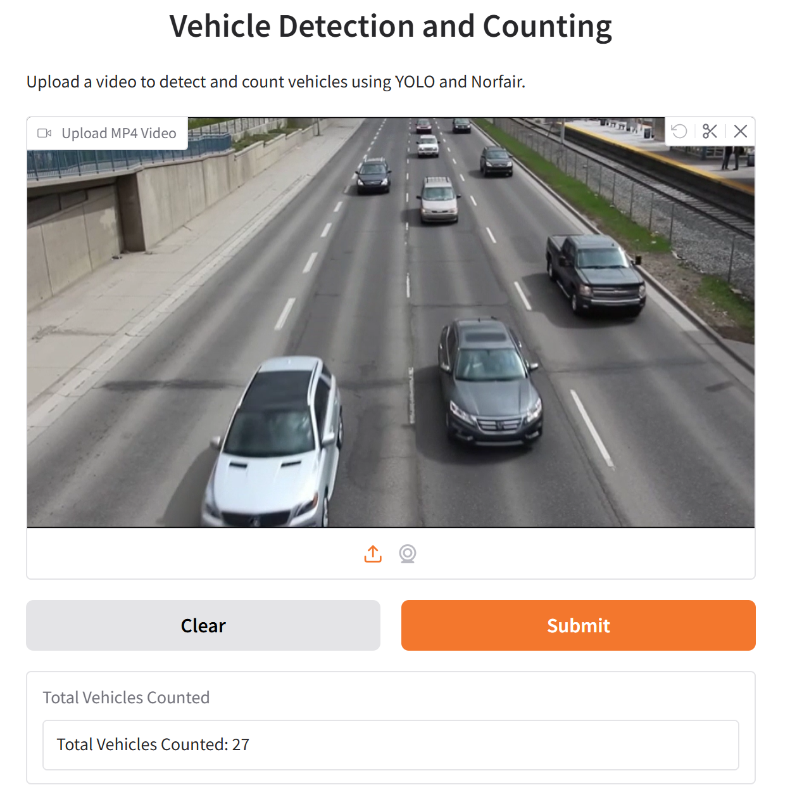

# 🚗 Vehicle Detection and Counting

A **computer vision** project using **YOLOv11** for vehicle detection, **Norfair** for tracking, and **Gradio** for the user interface.

# Features
- **Real-time vehicle detection** with YOLOv11
- **Object tracking** using Norfair
- **Interactive web interface** powered by Gradio

## 🛠️ Installation

```sh
git clone https://github.com/ryannaidji/Vehicle_Detection_Tracking.git
cd Vehice_Detection_Tracking
pip install -r requirements.txt
```

## 🎯 Usage

- Run the web interface:

```sh
python main.py
```

- Upload your video and wait for results

OR

- Run vehicle tracking directly
```sh
python src/vehicle_tracking.py
```

## 🖼️ Preview

- Web interface



- Vehicle tracking

